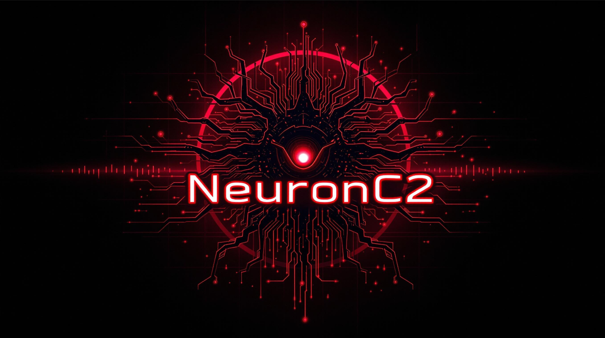
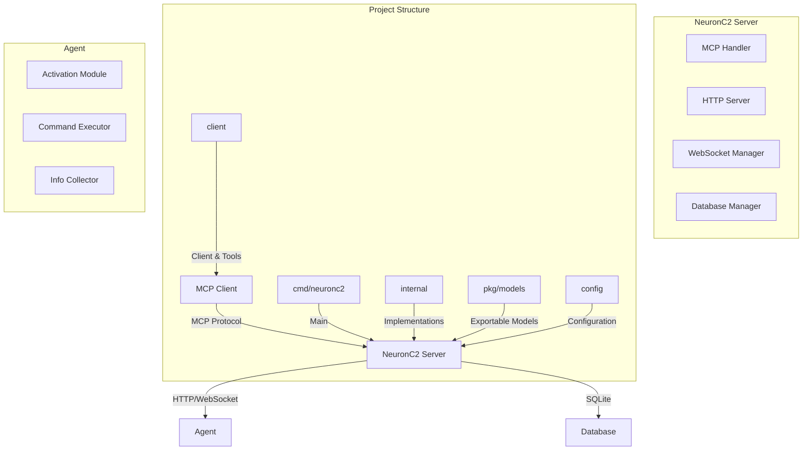

# NeuronC2 Framework

<p align="center">
  
</p>
<p align="center">
  <strong>Advanced Command and Control Framework powered by Model Context Protocol</strong>
</p>

<p align="center">
  <a href="#features">Features</a> •
  <a href="#architecture">Architecture</a> •
  <a href="#installation">Installation</a> •
  <a href="#usage">Usage</a> •
  <a href="#api">API</a> •
  <a href="#security">Security</a> •
  <a href="#contributing">Contributing</a>
</p>

<p align="center">
  
  
  
</p>

---

## Features

- **Model Context Protocol (MCP) Integration**: Seamless agent control through AI interfaces
- **Secure Authentication**: Token-based deployment and API key authentication
- **SQLite Database**: Persistent storage for agents, commands, and deployment tokens
- **Windows Support**: Currently supports Windows agents exclusively
- **System Information**: Comprehensive system information gathering
- **WebSocket Communication**: Real-time bidirectional communication
- **Command History**: Complete logging of all executed commands
- **Token Management**: Granular control over deployment tokens

## Architecture



## Project Structure

```
neuronc2/
├── assets/               # Static resources (logos, images)
├── client/               # Client and deployment tools
│   ├── client.go         # Client implementation
│   └── deploy.bat        # Windows deployment script
├── cmd/
│   └── neuronc2/         # Main entry point
│       ├── main.go       # Main file
│       └── c2_database.db # SQLite database
├── config/
│   └── config.go         # Project configuration
├── internal/             # Internal implementations
│   ├── agent/            # Agent logic
│   ├── auth/             # Authentication
│   ├── database/         # Data access layer
│   ├── mcptools/         # MCP tools
│   ├── server/           # Server implementation
│   └── utils/            # Utilities
├── pkg/
│   └── models/           # Exportable data models
├── example/              # Usage examples
├── go.mod                # Project dependencies
└── go.sum                # Dependency checksums
```

### MCP Configuration

Create an MCP configuration file (e.g., `claude-desktop.json`):

```json
{
  "mcpServers": {
    "c2_server": {
      "command": "insert you path binary c2"
    }
  }
}
```

Replace `"insert you path binary c2"` with the full path to the C2 server binary.

## Requirements

- Go 1.24 or higher
- SQLite3
- PowerShell

## Installation

### Server Setup

1. Clone the repository:
```bash
git clone https://github.com/3xploit666/neuronc2.1.git
cd neuronc2
```

2. Install dependencies:
```bash
go mod download
```

3. Build the server:
```bash
go build -o neuronc2.1 ./cmd/neuronc2.1/main.go
```

4. Run the server:
```bash
./neuronc2.1
```

The server will start on:
- HTTP: `:8080` (for agent communication)
- MCP: `stdio` (for MCP client communication)

### Agent Deployment

1. Generate a deployment token:
```bash
generate_deployment_token notes="Production deployment" duration="7d" max_uses=5
```

2. Compile the agent:
```bash
./client/deploy.bat -Token "DEPLOY-xxxxxxxxxxxxx"
```

## Usage

### MCP Commands

The NeuronC2 framework exposes the following MCP tools:

#### Agent Management
- `list_agents` - List all connected agents
- `list_all_agents` - List all agents (connected and disconnected)
- `get_agent_info` - Get detailed information about a specific agent
- `send_command` - Send a command to an agent

#### Token Management
- `generate_deployment_token` - Generate a new deployment token
- `list_tokens` - List all deployment tokens
- `revoke_token` - Revoke a deployment token

#### System Commands
- `get_system_info` - Gather system information from an agent
- `list_processes` - List running processes on an agent

#### Database Operations
- `get_database_stats` - Get database statistics
- `get_command_history` - Get command history for an agent

### Usage Example

```python
# Generate a deployment token
mcp.generate_deployment_token(
    notes="Production deployment",
    duration="7d",
    max_uses=5
)

# List connected agents
agents = mcp.list_agents()

# Send a command to an agent
result = mcp.send_command(
    agent_id="agent-abc123",
    command="whoami"
)
```

## Security Features

### Authentication Flow

1. **Token Generation**: Administrator generates deployment tokens with specific restrictions
2. **Agent Activation**: Agent uses token to activate and receive API credentials
3. **Secure Communication**: All agent communication uses API key authentication
4. **Token Expiration**: Tokens have configurable expiration and usage limits

### Best Practices

- Always use HTTPS in production
- Rotate API keys regularly
- Monitor command history for suspicious activities
- Set appropriate expiration times for tokens
- Implement network segmentation

## Database Schema

```sql
-- Deployment tokens
CREATE TABLE deployment_tokens (
    id INTEGER PRIMARY KEY AUTOINCREMENT,
    token TEXT UNIQUE NOT NULL,
    valid_until DATETIME NOT NULL,
    max_uses INTEGER NOT NULL,
    used_count INTEGER DEFAULT 0,
    created_at DATETIME NOT NULL,
    notes TEXT
);

-- Agents
CREATE TABLE agents (
    id INTEGER PRIMARY KEY AUTOINCREMENT,
    agent_id TEXT UNIQUE NOT NULL,
    api_key TEXT UNIQUE NOT NULL,
    hostname TEXT,
    username TEXT,
    os TEXT,
    arch TEXT,
    activated_at DATETIME NOT NULL,
    last_seen DATETIME NOT NULL
);

-- Command history
CREATE TABLE command_history (
    id INTEGER PRIMARY KEY AUTOINCREMENT,
    agent_id TEXT NOT NULL,
    command TEXT,
    response TEXT,
    executed_at DATETIME NOT NULL,
    FOREIGN KEY(agent_id) REFERENCES agents(agent_id)
);
```

## Configuration

### Environment Variables

| Variable | Description | Default Value |
|----------|-------------|---------|
| `SERVER_NAME` | Server name | `NeuronC2` |
| `SERVER_VERSION` | Server version | `1.0.0` |
| `DATABASE_PATH` | SQLite database path | `./c2_database.db` |
| `PORT` | HTTP server port | `:8080` |

## API Reference

### HTTP Endpoints

#### `POST /activate`
Activate a new agent with a deployment token.

**Request:**
```json
{
  "token": "DEPLOY-xxxxxxxxxxxxx",
  "metadata": {
    "hostname": "DESKTOP-ABC",
    "username": "john",
    "os": "windows",
    "arch": "amd64"
  }
}
```

**Response:**
```json
{
  "agent_id": "agent-abc123",
  "api_key": "xxxxxxxxxxxxxxxxxxxxxxxxxxxxxxxxxxxxxxxxxxxxxxxxxxxxxxxxxxxxxxxx",
  "status": "activated"
}
```

#### `WS /agent`
WebSocket endpoint for agent communication.

**Headers:**
- `X-API-Key`: Agent API key

## Roadmap

### Future Enhancements
- Improve communication security
- Implement real-time monitoring dashboard
- Add advanced search capabilities in command history
- Develop responsive web interface
- Implement automatic update system


## License

This project is licensed under the MIT License - see the [LICENSE](LICENSE) file for details.

## Legal Notice

This tool is for educational purposes and authorized testing only. Users are responsible for complying with applicable laws and regulations. The authors assume no responsibility for misuse or damage caused by this software.

## Acknowledgments

- [Model Context Protocol (MCP)](https://github.com/mark3labs/mcp-go) by Mark3Labs
- [Gorilla WebSocket](https://github.com/gorilla/websocket)
- [SQLite](https://www.sqlite.org/)

---

<p align="center">Developed by 3xploit666</p>
