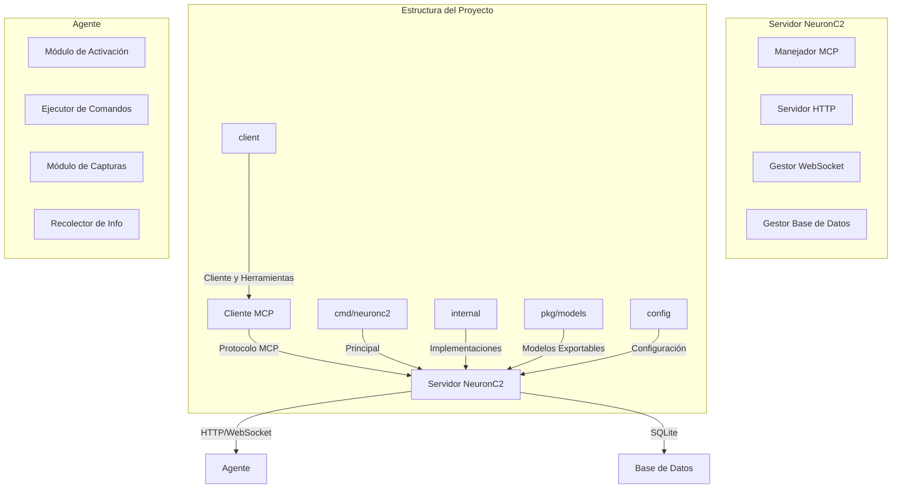

# NeuronC2 Framework

<p align="center">
  
</p>
<p align="center">
  <strong>Framework Avanzado de Comando y Control potenciado por el Protocolo de Contexto de Modelo</strong>
</p>

<p align="center">
  <a href="#características">Características</a> •
  <a href="#arquitectura">Arquitectura</a> •
  <a href="#instalación">Instalación</a> •
  <a href="#uso">Uso</a> •
  <a href="#api">API</a> •
  <a href="#seguridad">Seguridad</a> •
  <a href="#contribuciones">Contribuciones</a>
</p>

<p align="center">
  
  
  
</p>

---

## 🚀 Características

- **🔌 Integración con Protocolo de Contexto de Modelo (MCP)**: Control fluido de agentes a través de interfaces de IA
- **🔐 Autenticación Segura**: Despliegue basado en tokens y autenticación con claves API
- **💾 Base de Datos SQLite**: Almacenamiento persistente para agentes, comandos y tokens de despliegue
- **🖥️ Windows**: Actualmente solo compatible con agentes Windows
- **📸 Captura de Pantalla**: Captura remota de pantalla con redimensionamiento automático
- **📊 Información del Sistema**: Recopilación completa de información del sistema
- **🔄 Comunicación WebSocket**: Comunicación bidireccional en tiempo real
- **📝 Historial de Comandos**: Registro completo de todos los comandos ejecutados
- **🛡️ Gestión de Tokens**: Control granular sobre tokens de despliegue

## 🏗️ Arquitectura



## 📦 Estructura del Proyecto

```
neuronc2/
├── assets/               # Recursos estáticos (logos, imágenes)
├── client/               # Cliente y herramientas de despliegue
│   ├── client.go         # Implementación del cliente
│   ├── deploy.bat        # Script de despliegue para Windows
│   └── deploy.sh         # Script de despliegue para Linux
├── cmd/
│   └── neuronc2/         # Punto de entrada principal
│       ├── main.go       # Archivo principal
│       └── c2_database.db # Base de datos SQLite
├── config/
│   └── config.go         # Configuración del proyecto
├── internal/             # Implementaciones internas
│   ├── agent/            # Lógica del agente
│   ├── auth/             # Autenticación
│   ├── database/         # Capa de acceso a datos
│   ├── mcptools/         # Herramientas MCP
│   ├── server/           # Implementación del servidor
│   └── utils/            # Utilidades
├── pkg/
│   └── models/           # Modelos de datos exportables
├── example/              # Ejemplos de uso
├── go.mod                # Dependencias del proyecto
├── go.sum                # Checksums de dependencias
├── install.sh            # Script de instalación
└── README.md             # Documentación
```

### Configuración del MCP

Crea un archivo de configuración para el MCP (por ejemplo `claude-desktop.json`):

```json
{
  "mcpServers": {
    "c2_server": {
      "command": "insert you path binary c2"
    }
  }
}
```

Reemplaza `"insert you path binary c2"` con la ruta completa al binario del servidor C2.

## 📋 Requisitos

- Go 1.24 o superior
- SQLite3
- Para agentes Windows: PowerShell
- Para la funcionalidad de capturas de pantalla: `github.com/kbinani/screenshot`

## 🛠️ Instalación

### Configuración del Servidor

1. Clonar el repositorio:
```bash
git clone https://github.com/tuusuario/neuronc2.git
cd neuronc2
```

2. Instalar dependencias:
```bash
go mod download
```

3. Compilar el servidor:
```bash
go build -o neuronc2 ./cmd/neuronc2/main.go
```

4. Ejecutar el servidor:
```bash
./neuronc2
```

El servidor se iniciará en:
- HTTP: `:8080` (para comunicación con agentes)
- MCP: `stdio` (para comunicación con cliente MCP)

### Despliegue de Agentes

1. Generar un token de despliegue:
```bash
# A través del cliente MCP
generate_deployment_token notes="Despliegue de producción" duration="7d" max_uses=5
```

2. Compilar el agente:
```bash
# Windows
./client/deploy.bat -Token "DEPLOY-xxxxxxxxxxxxx"

# Linux
./client/deploy.sh --token "DEPLOY-xxxxxxxxxxxxx"
```

## 🎮 Uso

### Comandos MCP

El framework NeuronC2 expone las siguientes herramientas MCP:

#### Gestión de Agentes
- `list_agents` - Listar todos los agentes conectados
- `list_all_agents` - Listar todos los agentes (conectados y desconectados)
- `get_agent_info` - Obtener información detallada sobre un agente específico
- `send_command` - Enviar un comando a un agente

#### Gestión de Tokens
- `generate_deployment_token` - Generar un nuevo token de despliegue
- `list_tokens` - Listar todos los tokens de despliegue
- `revoke_token` - Revocar un token de despliegue

#### Comandos del Sistema
- `get_system_info` - Recopilar información del sistema de un agente
- `capture_screen` - Capturar una imagen de la pantalla de un agente
- `list_processes` - Listar procesos en ejecución en un agente

#### Operaciones de Base de Datos
- `get_database_stats` - Obtener estadísticas de la base de datos
- `get_command_history` - Obtener historial de comandos para un agente

### Ejemplo de Uso

```python
# Generar un token de despliegue
mcp.generate_deployment_token(
    notes="Despliegue de producción",
    duration="7d",
    max_uses=5
)

# Listar agentes conectados
agents = mcp.list_agents()

# Enviar un comando a un agente
result = mcp.send_command(
    agent_id="agent-abc123",
    command="whoami"
)

# Capturar una pantalla
screenshot = mcp.capture_screen(agent_id="agent-abc123")
```

## 🔒 Características de Seguridad

### Flujo de Autenticación

1. **Generación de Tokens**: El administrador genera tokens de despliegue con restricciones específicas
2. **Activación del Agente**: El agente usa el token para activarse y recibir credenciales API
3. **Comunicación Segura**: Toda la comunicación del agente usa autenticación con clave API
4. **Expiración de Tokens**: Los tokens tienen límites configurables de expiración y usos

### Mejores Prácticas

- 🔐 Utilizar siempre HTTPS en producción
- 🔑 Rotar claves API regularmente
- 📝 Monitorear el historial de comandos en busca de actividades sospechosas
- ⏰ Establecer tiempos de expiración adecuados para los tokens
- 🛡️ Implementar segmentación de red

## 📊 Esquema de Base de Datos

```sql
-- Tokens de despliegue
CREATE TABLE deployment_tokens (
    id INTEGER PRIMARY KEY AUTOINCREMENT,
    token TEXT UNIQUE NOT NULL,
    valid_until DATETIME NOT NULL,
    max_uses INTEGER NOT NULL,
    used_count INTEGER DEFAULT 0,
    created_at DATETIME NOT NULL,
    notes TEXT
);

-- Agentes
CREATE TABLE agents (
    id INTEGER PRIMARY KEY AUTOINCREMENT,
    agent_id TEXT UNIQUE NOT NULL,
    api_key TEXT UNIQUE NOT NULL,
    hostname TEXT,
    username TEXT,
    os TEXT,
    arch TEXT,
    activated_at DATETIME NOT NULL,
    last_seen DATETIME NOT NULL
);

-- Historial de comandos
CREATE TABLE command_history (
    id INTEGER PRIMARY KEY AUTOINCREMENT,
    agent_id TEXT NOT NULL,
    command TEXT,
    response TEXT,
    executed_at DATETIME NOT NULL,
    FOREIGN KEY(agent_id) REFERENCES agents(agent_id)
);
```

## 🔧 Configuración

### Variables de Entorno

| Variable | Descripción | Valor Predeterminado |
|----------|-------------|---------|
| `SERVER_NAME` | Nombre del servidor | `NeuronC2` |
| `SERVER_VERSION` | Versión del servidor | `1.0.0` |
| `DATABASE_PATH` | Ruta de la base de datos SQLite | `./c2_database.db` |
| `SCREENSHOT_DIR` | Directorio de almacenamiento de capturas | `screenshots` |
| `PORT` | Puerto del servidor HTTP | `:8080` |

## 📚 Referencia de API

### Endpoints HTTP

#### `POST /activate`
Activar un nuevo agente con un token de despliegue.

**Solicitud:**
```json
{
  "token": "DEPLOY-xxxxxxxxxxxxx",
  "metadata": {
    "hostname": "DESKTOP-ABC",
    "username": "john",
    "os": "windows",
    "arch": "amd64"
  }
}
```

**Respuesta:**
```json
{
  "agent_id": "agent-abc123",
  "api_key": "xxxxxxxxxxxxxxxxxxxxxxxxxxxxxxxxxxxxxxxxxxxxxxxxxxxxxxxxxxxxxxxx",
  "status": "activated"
}
```

#### `WS /agent`
Endpoint WebSocket para comunicación con agentes.

**Cabeceras:**
- `X-API-Key`: Clave API del agente

## 🚀 Despliegue

### Despliegue con Docker

```dockerfile
FROM golang:1.24-alpine AS builder
WORKDIR /app
COPY . .
RUN go build -o neuronc2 ./cmd/neuronc2/main.go

FROM alpine:latest
WORKDIR /app
COPY --from=builder /app/neuronc2 .
EXPOSE 8080
CMD ["./neuronc2"]
```

```bash
docker build -t neuronc2 .
docker run -p 8080:8080 neuronc2
```

### Despliegue en Kubernetes

```yaml
apiVersion: apps/v1
kind: Deployment
metadata:
  name: neuronc2
spec:
  replicas: 1
  selector:
    matchLabels:
      app: neuronc2
  template:
    metadata:
      labels:
        app: neuronc2
    spec:
      containers:
      - name: neuronc2
        image: neuronc2:latest
        ports:
        - containerPort: 8080
        volumeMounts:
        - name: data
          mountPath: /app/data
      volumes:
      - name: data
        persistentVolumeClaim:
          claimName: neuronc2-data
```

## 📝 Tareas Pendientes y Mejoras Futuras

### Tareas Pendientes
- 🔧 Reparar la funcionalidad de captura de pantalla

### Mejoras Futuras
- 🖥️ Agregar soporte para agentes Linux
- 🔒 Mejorar la seguridad en las comunicaciones
- 📊 Implementar dashboard de monitoreo en tiempo real
- 🔍 Agregar capacidades de búsqueda avanzada en el historial de comandos
- 📱 Desarrollar interfaz web responsive
- 🔄 Implementar sistema de actualizaciones automáticas

## 🤝 Contribuciones

1. Haz un fork del repositorio
2. Crea tu rama de características (`git checkout -b feature/CaracteristicaIncreible`)
3. Haz commit de tus cambios (`git commit -m 'Añadir alguna CaracteristicaIncreible'`)
4. Haz push a la rama (`git push origin feature/CaracteristicaIncreible`)
5. Abre un Pull Request

## 📄 Licencia

Este proyecto está licenciado bajo la Licencia MIT - consulta el archivo [LICENSE](LICENSE) para más detalles.

## ⚠️ Aviso Legal

Esta herramienta es solo para fines educativos y pruebas autorizadas. Los usuarios son responsables de cumplir con las leyes y regulaciones aplicables. Los autores no asumen ninguna responsabilidad por el mal uso o daños causados por este software.

## 🙏 Agradecimientos

- [Protocolo de Contexto de Modelo (MCP)](https://github.com/mark3labs/mcp-go) por Mark3Labs
- [Gorilla WebSocket](https://github.com/gorilla/websocket)
- [Biblioteca de capturas de pantalla](https://github.com/kbinani/screenshot)
- [SQLite](https://www.sqlite.org/)

---

<p align="center">Desarrollado con ❤️ por 3xploit666</p>