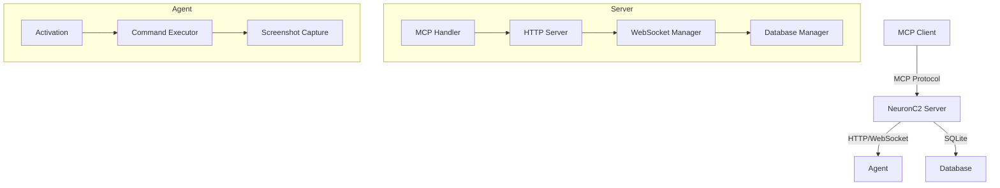

<div align="center">

# NeuronC2

**Advanced Command & Control Framework powered by Model Context Protocol**


[](https://go.dev/)
[](https://modelcontextprotocol.io/)
[](https://www.microsoft.com/windows)
[](https://opensource.org/licenses/MIT)

[Features](#features) · [Architecture](#architecture) · [Installation](#installation) · [Usage](#usage) · [API](#api-reference) · [Security](#security-features)

</div>

---

## Overview

NeuronC2 is a Command & Control framework that integrates with the **Model Context Protocol (MCP)**, enabling AI-powered agent management through natural language. Control agents, execute commands, capture screenshots, and manage deployments — all through your MCP-compatible AI client.

## Features

| Feature | Description |
|---------|-------------|
| **MCP Integration** | Full agent control through AI interfaces (Claude, etc.) |
| **Token Auth** | Deployment tokens with expiration and usage limits |
| **WebSocket Comms** | Real-time bidirectional agent communication |
| **SQLite Storage** | Persistent storage for agents, commands, and tokens |
| **Screenshot Capture** | Remote desktop capture with compression |
| **Command History** | Complete audit trail of all executed commands |
| **Windows Agent** | Native Windows agent with auto-reconnect |

## Architecture



## Project Structure

```
neuronc2/
├── client/               # Agent implementation
│   ├── client.go         # Windows agent with WebSocket reconnect
│   ├── deploy.bat        # Windows deployment script
│   └── deploy.sh         # Linux deployment script
├── cmd/neuronc2/         # Server entry point
│   └── main.go           # HTTP + MCP server bootstrap
├── config/
│   └── config.go         # Environment-based configuration
├── internal/
│   ├── agent/            # Agent session management
│   ├── auth/             # Token authentication
│   ├── database/         # SQLite data access layer
│   ├── mcptools/         # MCP tool definitions
│   ├── server/           # HTTP/WebSocket server
│   └── utils/            # Shared utilities
├── pkg/models/           # Exportable data models
└── assets/               # Logo and images
```

## Requirements

- **Go** 1.24+
- **SQLite3**
- **Windows** (agent target)

## Installation

### Server

```bash
git clone https://github.com/3xploit666/neuronc2.1.git
cd neuronc2.1
go mod download
go build -o neuronc2 ./cmd/neuronc2/main.go
./neuronc2
```

The server starts on:
- **HTTP** `:8080` — agent communication
- **MCP** `stdio` — AI client integration

### MCP Configuration

Add to your MCP client config (e.g., `claude_desktop_config.json`):

```json
{
  "mcpServers": {
    "neuronc2": {
      "command": "/path/to/neuronc2"
    }
  }
}
```

### Agent Deployment

1. Generate a deployment token via MCP
2. Compile the agent:

```bash
# Windows
cd client && deploy.bat -Token "DEPLOY-xxxxxxxxxxxxx"
```

## Usage

### MCP Tools

| Category | Tool | Description |
|----------|------|-------------|
| **Agents** | `list_agents` | List connected agents |
| | `list_all_agents` | List all agents (connected + offline) |
| | `get_agent_info` | Detailed agent information |
| | `send_command` | Execute command on agent |
| **Tokens** | `generate_deployment_token` | Create deployment token |
| | `list_tokens` | List all tokens |
| | `revoke_token` | Revoke a token |
| **System** | `get_system_info` | Agent system information |
| | `list_processes` | Running processes |
| | `screenshot` | Capture remote desktop |
| **Database** | `get_database_stats` | Storage statistics |
| | `get_command_history` | Command audit log |

### Example

```python
# Generate a deployment token
mcp.generate_deployment_token(
    notes="Production deployment",
    duration="7d",
    max_uses=5
)

# List connected agents
agents = mcp.list_agents()

# Execute command on agent
result = mcp.send_command(
    agent_id="agent-abc123",
    command="whoami"
)
```

## Security Features

### Authentication Flow

```
1. Admin generates deployment token (with expiry + max uses)
2. Agent activates with token → receives unique API key
3. All communication authenticated via X-API-Key header
4. Tokens auto-expire and track usage count
```

### Best Practices

- Use **HTTPS** in production (reverse proxy with TLS)
- **Rotate API keys** regularly
- Set short **token expiration** times
- Monitor **command history** for anomalies
- Deploy behind **network segmentation**

## Configuration

| Variable | Description | Default |
|----------|-------------|---------|
| `SERVER_NAME` | Server identifier | `NeuronC2` |
| `SERVER_VERSION` | Version string | `1.0.0` |
| `DATABASE_PATH` | SQLite database path | `./c2_database.db` |
| `PORT` | HTTP server port | `:8080` |
| `SCREENSHOT_DIR` | Screenshot storage | `screenshots` |
| `COMMAND_TIMEOUT` | Execution timeout | `30s` |

## API Reference

### `POST /activate`

Activate a new agent with a deployment token.

```json
// Request
{
  "token": "DEPLOY-xxxxxxxxxxxxx",
  "metadata": {
    "hostname": "DESKTOP-ABC",
    "username": "john",
    "os": "windows",
    "arch": "amd64"
  }
}

// Response
{
  "agent_id": "agent-abc123",
  "api_key": "xxxxxxxxxxxxxxxxxxxxxxxxxxxxxxxx",
  "status": "activated"
}
```

### `WS /agent`

WebSocket endpoint for agent communication. Requires `X-API-Key` header.

## Roadmap

- [ ] Encrypted communications (TLS/mTLS)
- [ ] Web monitoring dashboard
- [ ] Advanced command history search
- [ ] Automatic agent update system
- [ ] Linux/macOS agent support

## Legal Disclaimer

> **This tool is for educational purposes and authorized testing only.** Users are responsible for complying with applicable laws. The author assumes no responsibility for misuse or damage caused by this software.

## Author

**[@3xploit666](https://github.com/3xploit666)** · [Blog](https://www.3xploitdev.com/)

---

<div align="center">

*For educational and authorized security testing purposes only.*

</div>
