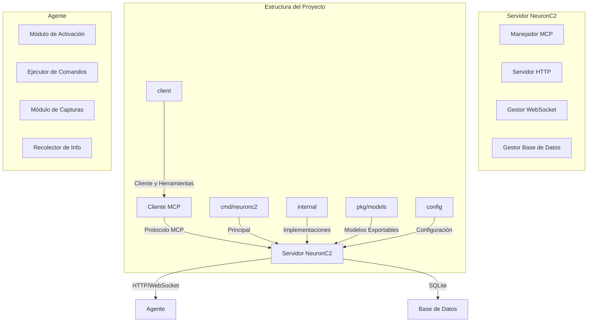
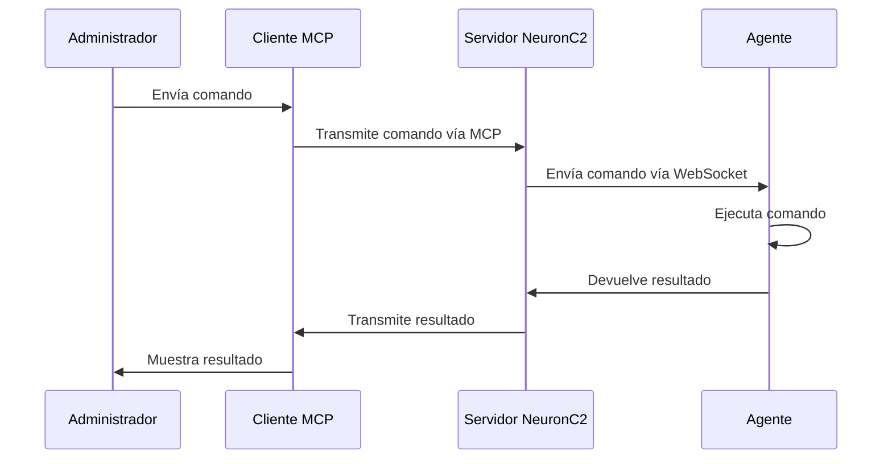
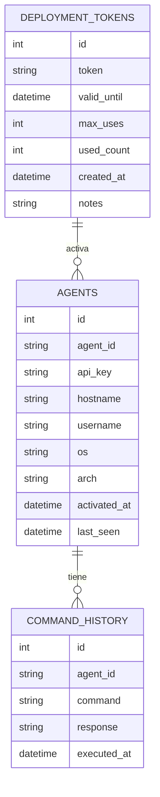
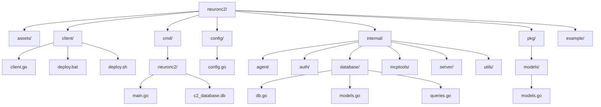
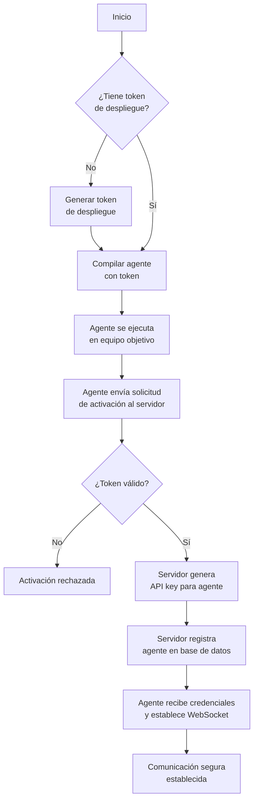

# Diagrama de Arquitectura NeuronC2

## Arquitectura General

```mermaid
graph TD
    A[Cliente MCP] -->|Protocolo MCP| B[Servidor NeuronC2]
    B -->|HTTP/WebSocket| C[Agente]
    B -->|SQLite| D[Base de Datos]
    
    subgraph "Servidor NeuronC2"
        B1[Manejador MCP]
        B2[Servidor HTTP]
        B3[Gestor WebSocket]
        B4[Gestor Base de Datos]
    end
    
    subgraph "Estructura del Proyecto"
        E1[cmd/neuronc2] -->|Principal| B
        E2[internal] -->|Implementaciones| B
        E3[pkg/models] -->|Modelos Exportables| B
        E4[client] -->|Cliente y Herramientas| A
        E5[config] -->|Configuración| B
    end
    
    subgraph "Agente"
        C1[Módulo de Activación]
        C2[Ejecutor de Comandos]
        C3[Módulo de Capturas]
        C4[Recolector de Info]
    end
```

## Flujo de Comunicación

```mermaid
sequenceDiagram
    participant Admin as Administrador
    participant MCP as Cliente MCP
    participant Server as Servidor NeuronC2
    participant Agent as Agente

    Admin->>MCP: Envía comando
    MCP->>Server: Transmite comando vía MCP
    Server->>Agent: Envía comando vía WebSocket
    Agent->>Agent: Ejecuta comando
    Agent->>Server: Devuelve resultado
    Server->>MCP: Transmite resultado
    MCP->>Admin: Muestra resultado
```

## Estructura de la Base de Datos

```mermaid
erDiagram
    AGENTS ||--o{ COMMAND_HISTORY : "tiene"
    DEPLOYMENT_TOKENS ||--o{ AGENTS : "activa"
    
    AGENTS {
        int id
        string agent_id
        string api_key
        string hostname
        string username
        string os
        string arch
        datetime activated_at
        datetime last_seen
    }
    
    COMMAND_HISTORY {
        int id
        string agent_id
        string command
        string response
        datetime executed_at
    }
    
    DEPLOYMENT_TOKENS {
        int id
        string token
        datetime valid_until
        int max_uses
        int used_count
        datetime created_at
        string notes
    }
```

## Estructura del Proyecto

```mermaid
graph TD
    Root["neuronc2/"] --> Assets["assets/"]
    Root --> Client["client/"]
    Root --> Cmd["cmd/"]
    Root --> Config["config/"]
    Root --> Internal["internal/"]
    Root --> Pkg["pkg/"]
    Root --> Example["example/"]
    
    Client --> ClientGo["client.go"]
    Client --> DeployBat["deploy.bat"]
    Client --> DeploySh["deploy.sh"]
    
    Cmd --> NeuronC2["neuronc2/"]
    NeuronC2 --> MainGo["main.go"]
    NeuronC2 --> Database["c2_database.db"]
    
    Config --> ConfigGo["config.go"]
    
    Internal --> Agent["agent/"]
    Internal --> Auth["auth/"]
    Internal --> DatabaseDir["database/"]
    Internal --> MCPTools["mcptools/"]
    Internal --> Server["server/"]
    Internal --> Utils["utils/"]
    
    Pkg --> Models["models/"]
    Models --> ModelsGo["models.go"]
    
    DatabaseDir --> DbGo["db.go"]
    DatabaseDir --> DBModelsGo["models.go"]
    DatabaseDir --> QueriesGo["queries.go"]
```

## Flujo de Autenticación y Activación

```mermaid
flowchart TD
    A[Inicio] --> B{¿Tiene token\nde despliegue?}
    B -->|No| C[Generar token\nde despliegue]
    C --> D[Compilar agente\ncon token]
    B -->|Sí| D
    D --> E[Agente se ejecuta\nen equipo objetivo]
    E --> F[Agente envía solicitud\nde activación al servidor]
    F --> G{¿Token válido?}
    G -->|No| H[Activación rechazada]
    G -->|Sí| I[Servidor genera\nAPI key para agente]
    I --> J[Servidor registra\nagente en base de datos]
    J --> K[Agente recibe credenciales\ny establece WebSocket]
    K --> L[Comunicación segura\nestablecida]
``` 